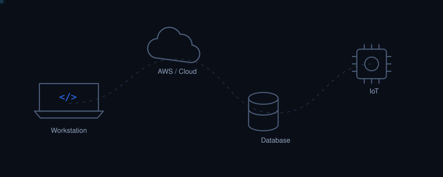
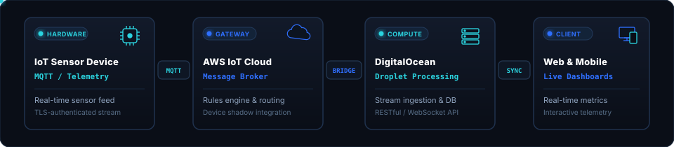

  
  

### ⚡ Executive Profile

**B.Tech Artificial Intelligence & Data Science** graduate (CGPA 7.5) from **Jansons Institute of Technology**, Coimbatore. 

I operate across the complete system lifecycle — from embedded IoT telemetry to cloud backends, database architecture, and high-performance interactive web frontends. With **three sequential/concurrent industry roles**, I have:
- Led development teams in shipping enterprise platforms with AI-assisted documentation.
- Built quality-management web portals with SQL automation for a life-sciences company.
- Engineered hardware-to-cloud data pipelines from physical sensor devices to cloud analytics.
- Delivered technical hands-on workshops across **10+ engineering colleges**.

📍 **Based in:** Coimbatore & Erode, Tamil Nadu, India  
🌱 **Specializations:** Full-Stack Development · Cloud & IoT Architectures · Database Engineering · Technical Leadership

 

### 🔄 End-to-End IoT & Cloud Architecture

  

A signature technical differentiator across my work is engineering the full hardware-to-app pipeline — acquiring real-time physical sensor data, transmitting over authenticated cloud message brokers, processing on scalable compute instances, and rendering on low-latency client dashboards.

### 🛠️ Technical Stack & Tools

<table>
  <tr>
    <td width="25%"><b>Frontend</b></td>
    <td>
      
      
      
      
      
      
    </td>
  </tr>
  <tr>
    <td><b>Backend & APIs</b></td>
    <td>
      
      
    </td>
  </tr>
  <tr>
    <td><b>Databases</b></td>
    <td>
      
      
      
    </td>
  </tr>
  <tr>
    <td><b>Cloud & DevOps</b></td>
    <td>
      
      
      
      
      
    </td>
  </tr>
  <tr>
    <td><b>IDEs & Tooling</b></td>
    <td>
      
      
      
      
      
    </td>
  </tr>
</table>

### 💼 Professional Industry Experience

#### 1. Software Developer — **Code Core Global HiTech Solutions**
`06/2025 – Present · Coimbatore, Tamil Nadu`
- **Team Leadership:** Led a development team building and deploying production web applications.
- **Full-Stack Engineering:** Developed scalable web applications and REST APIs using Python.
- **Database & DevOps:** Administered MySQL and MongoDB databases; executed Git code reviews and deployment pipelines.
- **AI-Assisted Workflows:** Authored structured technical documentation utilizing AI-driven summarization models.
- **Public Speaking:** Conducted hands-on technical workshops across **10+ engineering colleges**.

#### 2. Frontend Developer & Database Management — **Lakshmi Life Sciences Pvt. Ltd. (LLS)**
`01/2025 – 05/2025 · Coimbatore, Tamil Nadu`
- **Quality Plan Web Portal:** Engineered responsive user interfaces using HTML5, CSS3, and JavaScript.
- **Relational Databases:** Designed and queried SQL databases for quality plans, inspection reports, and calibration tracking.
- **Export Automation:** Implemented server-side automated PDF and Excel report generation.

#### 3. IoT & Cloud Intern — **Texro Automation**
`06/2026 – Present · Coimbatore, Tamil Nadu`
- **Telemetry Ingestion:** Connected embedded IoT sensor devices to AWS IoT Cloud via secure protocols.
- **Cloud Bridge:** Integrated AWS IoT with DigitalOcean compute instances for real-time stream processing.
- **Application Delivery:** Streamed processed sensor telemetry to live client web and mobile dashboards.

### 🚀 Featured Engineering Projects

| Project | Key Technologies | Description & Highlights |
|---|---|---|
| **[John A — Portfolio & Signal Path](https://github.com/JohntheAIdeveloper/john-a-portfolio)** | Tailwind CSS, Web Technologies | Production portfolio featuring telemetry data packets, developer avatar, and interactive IoT pipeline visualization. |
| **CC Ops (Operational Management System)** | Python, MySQL, AI APIs | Enterprise operations suite with task tracking, attendance/leave management, Git review workflows, meeting scheduling, and AI documentation summarization. |
| **Texro Automation Telemetry Portal** | AWS IoT, DigitalOcean | Full-stack IoT dashboard displaying real-time telemetry streaming from industrial devices to cloud backends. |
| **CodeMart — E-Commerce Platform** | JavaScript, Python REST APIs, PostgreSQL | High-performance e-commerce platform with product catalogs, shopping cart state management, and PostgreSQL database queries. |
| **Portfolio Mobile App** | Flutter, Dart, Cross-Platform UI | Mobile portfolio application with responsive layouts, smooth navigation, and hardware performance optimization. |
| **LLS Quality Management System** | JavaScript, MySQL, FPDF, PhpSpreadsheet | Production quality portal for external life sciences enterprise, tracking instruments, calibration cycles, and automated audit reports. |

### 📜 Certifications & Continuous Learning

- 🏅 **Python Programming**
- 🏅 **Additive Manufacturing & 3D Printing**
- 🏅 **ChatGPT for Everyone (AI Prompting & Automation)**
- 🏅 **HTML & CSS Advanced Architectures**
- 🏅 **Game Development using PyGame**
- 🏅 **GenAI Powered Data Analytics Job Simulation**
- 📚 *Currently learning:* **Harvard CS50x – Computer Science**

### 👥 Leadership & Speaking

- **Technical Workshop Speaker:** Delivered hands-on coding and cloud workshops across **10+ colleges** and **1 school**.
- **Yuva Leadership:** Executive Chair · Executive Co-Chair · Accessibility Chair · Accessibility Co-Chair.
- **Campus Involvement:** Secretary, JIT Music Club · NSS Volunteer & IT Wing.

### 📊 GitHub Activity & Statistics

  
  

  

### 🐍 Contribution Grid Animation

  

### 📬 Connect With Me

  
  
  
  

 

© 2026 John A. Master Portfolio Blueprint Alignment. All rights reserved.

